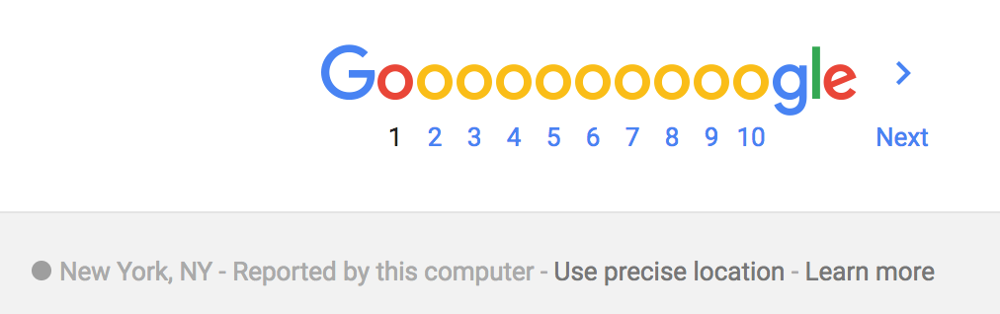
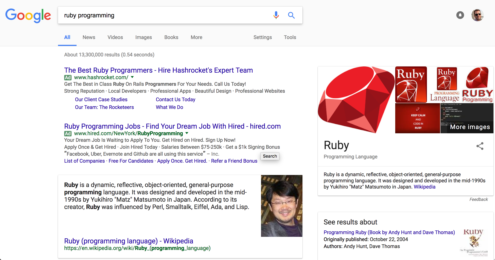

# DuckDuckGo

## Your actions at risk

When you browse a web page, the search engine keeps track of you so as to
personalize your experience. For example, if an engine knows you're in New York
City versus San Francisco, the recommended taco shop is going to be different.

Knowing where you are, knowing your IP address (your computer's place on the
internet) the "what you searched" can be associated with "where you were."
These records can be placed under subpoena so as to find out about your search
habits.

## How they spy on you

Here, I made a query for Ruby Programming. Google provides the footer at the
bottom.

## How you protect yourself

DuckDuckGo is a search engine that will make a request for you, return the
results to you, but which does not preserve location data.

### Using DuckDuckGo

1. Visit https://duckduckgo.com/
2. To perform an equivalent Google search use: `!google ruby programming`.
3. Receive the same results!

