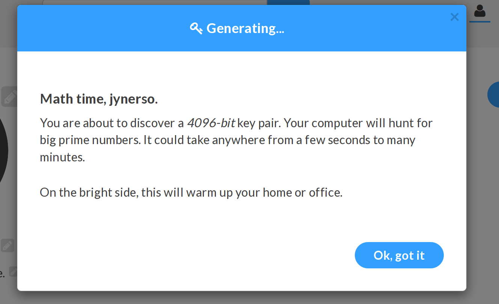

# Keybase.io

## Your actions at risk

Any form of text communication

  * email
  * text messages
  * chat rooms
  * social media
  * comments

## How they spy on you

Owners of the infrastructure you communicate on are able to see, modify or flat out deny any kind of message
that travels across their network. If they can read the message, they can also be compelled to allow the data
to be seen by others.

## How you protect yourself

If you encrypt the text itself, without relying on services to do it for you, 
you can take that encrypted text and send it over any medium of your choosing.
Only the person to whom it's intended can decrypt and read the message.

Keybase is a site that uses the tried-and-true yet difficult to understand, GPG.
You'll soon be able to send GPG encrypted messages to others without having to know the intricacies of GPG. 

### Using Keybase.io

1. Create an account on Keybase

  

2. Create your private key

  
  
  
  
  

3. Prove your identity:

  Click on Twitter (or some other type of proof you're willing to supply).
  This help others correlate your __Public Key__ and Keybase account to other well-known identities you own
  online. It will allow others to find and trust that this key belongs to you.

  
  
  

4. Signing your first message:

  Signing means you generate a unique string that can only possibly be generated by your private key. 
  By including it in your message, other can take your __Public Key__ and verify that you in fact signed this
  document.

  * Click on the Pen Icon in the top-right icon cluster. 

  
  

5. Encrypting your first message.

  * Click on the Lock Icon in the top-right icon cluster.
  * Find a user you wish to encrypt a message for.

  

  * Check the "Sign" check box if you wish to sign this message.
  * Click "Encrypt" and send the message by any means you choose.

  

6. Verifying a signature someone sent you

  * Click on the Check Icon in the top-right icon cluster.
  * Paste the signature in the box click "Verify"

  

  * Make sure it came from who you think!

  

7. Decrypting a message sent to you.

  * Click on the Unlocked Lock Icon in the top-right icon cluster.
  * Follow the same procedure from step 6.

### The Why

Keybase solves two problems with GPG. 

1. The GPG CLI interface is a little obtuse and does not enforce good practices when  dealing with key
   security.
2. GPG relies on a certain degree of trust. __Public Keys__ are sometimes exchanged in person and then signed.
   This adds to the "Web of Trust", letting others know, through social proof, that this __Public Key__ does
   belong to you. Keybase makes users associate social accounts to their __Public Key__, so when you visit
   their Keybase page, you can see that this Keybase account also owns several other public facing internet
   account. By verifying that those social account belong to the person I intednd to message, I can trust
   that this message is going to be encrypted for the correct person.

 If I want to secretly send a journalist some information, I'll need their __Public Key__. I can go to
 their Keybase account and see that their __Public Key__ is also associated with a website and Twitter
 account that I know belong to the journalist. This allows me a greater sense of confidence that I'm
 encrypting a message using the correct persons __Public Key__
