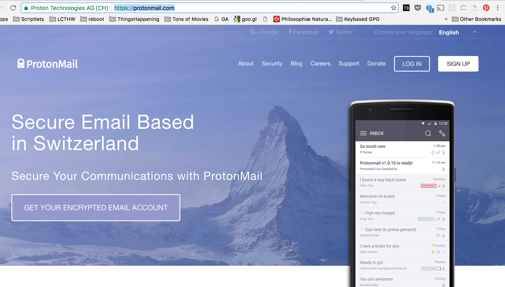
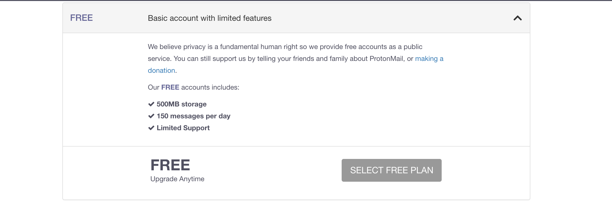
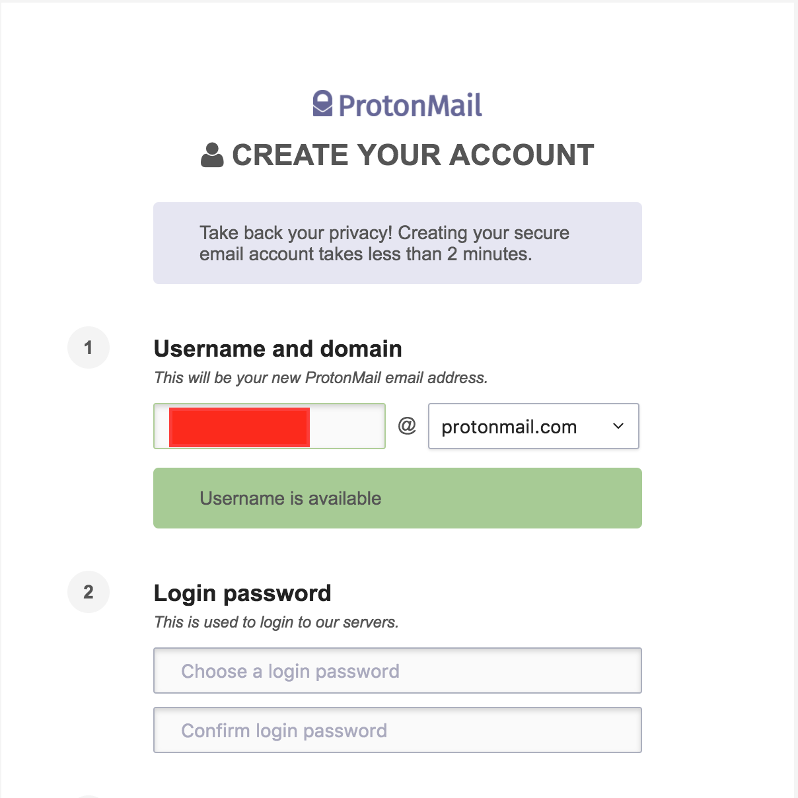
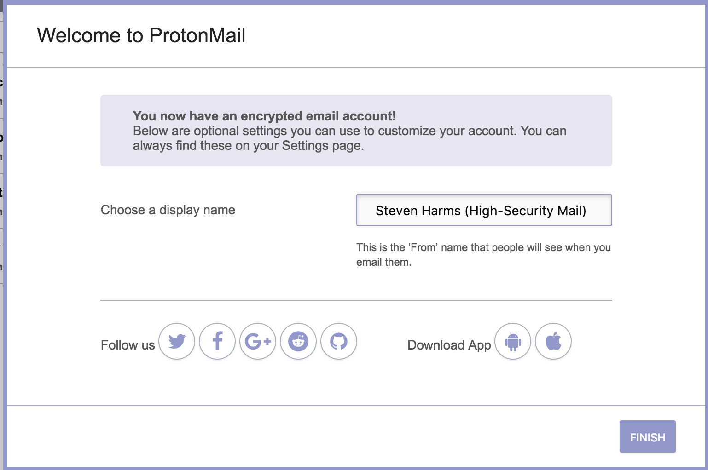

# Proton Mail

Email was the first "killer app" of the Internet. Today we take for granted how
much *our* email inbox is *ours*. Historically we have sacrificed security for
convenience. We have *hoped* that our email accounts were not being attacked by
nation-states or bad-actors. We have coddled ourselves with the thought:
"Nobody wants *my* mail, right?" These are naive thoughts that we can no longer
suffer under. We need secure email.

Proton Mail is a secure email platform designed to keep mail-in-flight and
mail-at-rest safe. In order to understand your exposure, let's introduce a
little bit of vocabulary.

## Vocabulary

**Mail Client or Mail User Agent (MUA)**: This is an application that's run on
a client computer. In the 90's mail applications of this variety would have
been Eudora or cc:Mail or Lotus Notes or Thunderbird. I'm explicitly **not**
discussing webmail (i.e.  GMail) here as they confuse the distinction between
"mail client" and "mail transfer agent."

**Mail Transfer Agent (MTA)**: This is a role played, most often, by a server.
An MTA receives an email from a _Mail Client_ and then has the burden of
routing that mail onward to the destination, handling retries, etc.

**Mail-at-Rest** is mail as it's being created or routed. As you compose email
on a mail client the data is (likely) being stored (in case your app crashes,
or if you decide to come back to it later). What format is this "mail at rest"
stored? Is it encrypted?

**Mail-in-Flight** as your MUA hands off your email to an MTA what are the
characteristics of that network connection? Are the data going across the
internet Incrypted? Or, are they, if captured, plaintext which could be used by
an attacker?

**Webmail** Webmail complicates analysis by fusing the MUA and the MTA together
in a web interface. As you type into the application your keystrokes across the
wire are "in flight." Are they encrypted? When those keystrokes are added toa
compose text area, is that temp space ("draft") stored in a secure fashion? And
are those completed documents sent to the recipient (mail-in-flight) in an
encrypted fashion?

Obviously there are a host of attack vectors.

## Your actions at risk

* Composing email
* Reading email
* Sending email

## How they spy on you

* Composing Mail on a PC or Phone:
  * A malicious software program could be installed such that it harvests your keystrokes and forwards them on
  * A malicious software program could be installed such that it forwards temporary files used to create a "draft" feature
  * A malicious software program could be installed such that it forwards insecure contents in your local "Sent" folder
* Suppose You compose mail on a secure machine (mail-at-rest is secure)
  * Attacker compromises your wifi router and shunts email traffic to a attacker data repository
  * Attacker compromises your wifi router, shunts the email and resends it with edited body e.g. "Protest Canceled" or "Abort: Danger!"
* Suppose you compose email in a secured system and that system uses a
  secured network socket to communicate to other hosts; an attacker compromises
  the encryption technology between these two servers and shunts email to an
  attacker data repository. This was actually done by the NSA at Google as an
  attack on GMail as revealed by the Snowden documents [1][]

## How you protect yourself

To protect ourselves we need to make sure that the MUA leaves nothing in
plaintext, we need to ensure that the data are transferred in an encyrpted
fashion, and we need to know that the recipient can verify that the email has
not been tampered with. Lastly, we would like for our and our correspondents'
email-at-rest to live in a country whose data protections are not easily
compromised by hackers or state actors.

It's a lot to take on: to this end we have [ProtonMail][]. Think of it as a
more secure GMail which:

* stores its data in the data-secure country of Switzerland
* has built its mobile MUA's to not leave mail-at-rest in an unencrypted state
* has integrated OpenPGP to ensure the integrity of your messages and that the
  sender is who you think it is.

### Using Proton Mail

#### Step 0: Visit the ProtonMail Site

#### Step 1: Sign Up!

In this example, we'll sign up for their free tier of service. Those commited
to data privacy should consider signing up to fund these efforts.

Notice that in the URL bar we're using HTTPS (secured web-browsing
communication). Anyone shunting our web traffic would only see encrypted data.
We're already starting off on a good foot! If we are doing this sign-up over a
VPN our data-in-flight are *doubly* encrypted. That's defense-in-depth!

OK, so now we're working with Protonmail a company that operates in an
environment where security and discretion is part of the business culture.

### Step 2: Specific Configuration Points

You'll be asked for a _login password_: you use this to access the Protonmail
web client. This is proof that you are you and that you should be able to use a
given Protonmail account.

Then there is the "decrypt mailbox" password. This is a password to verify that
you have the authorization to view the contents of the mailbox.

* **THESE PASSWORDS SHOULD NOT BE THE SAME**
* **THESE PASSWORDS SHOULD BE STRONG PASSWORDS (USE A PASSWORD MANAGER!)**
* **THESE PASSWORDS SHOULD BE REUSED FROM ANY OTHER SITE / APPLICATION**

Needless to say **do not have your browser save your password credentials**. If
your computer is in another person's physical custody, all your saved passwords
are at considerably more risk. Don't leave this, your email, your personal
inbox, vulnerable.

Congratulations - you now have a ProtonMail account!

#### Step 3: Use Protonmail Webmail

You'll be put into a webmail interface similar to GMail. Congratulations!
You're set up.

#### Step 4: Analysis

* Where do we have Mail-at-Rest: On a server, in Switzerland, encrypted
* Where does mail-in-flight on this server go? It travels secured, encrypted
  network pathways in Switzerland
* Where do your keystrokes go? They travel over HTTPS (in the browser) and
  thus travel encrypted. If you do the connection over a VPN the data is
  re-encrypted. If you use a TOR routing endpoint, the connections are
  scrambled.
* While all systems are vulnerable to attack, we've got defense in depth
  workin on our side
* What would happen in event of computer theft: Defeat lock screen, know how
  to log into ProtonMail, know encryption password. That's depth on our
  side again. We're working with as much security as we can. We could add
  OpenPGP for another layer of encryption (and we should!).

#### Step 4: Get a Mobile Client

Be sure and download the mobile client as well.

I use my Protonmail account as the "high security" email address. If the
content is something I want to be secure, I will **log in**, retrieve the
message / reply, and then **log out**. I don't want an open tab or a quickly
stolen mobile device to be the undoing of this most-intimate email inbox.

## Strategy

* Use Protonmail **primarily** on laptop
* Use hard, complex passwords for login and decrypt
* Rarely expect email here
* Demand correspondents to use OpenPGP to validate their identity
* Most email will come to my lower-security source but data which could
  compromise my person or my data goes here. Configure ProtonMail setting to
  send notifications to lower-security mail server when mail is receved there.

### Footnotes:

1.  [Washington Post](https://www.washingtonpost.com/world/national-security/nsa-infiltrates-links-to-yahoo-google-data-centers-worldwide-snowden-documents-say/2013/10/30/e51d661e-4166-11e3-8b74-d89d714ca4dd_story.html)

[Protonmail]: https://protonmail.com/
