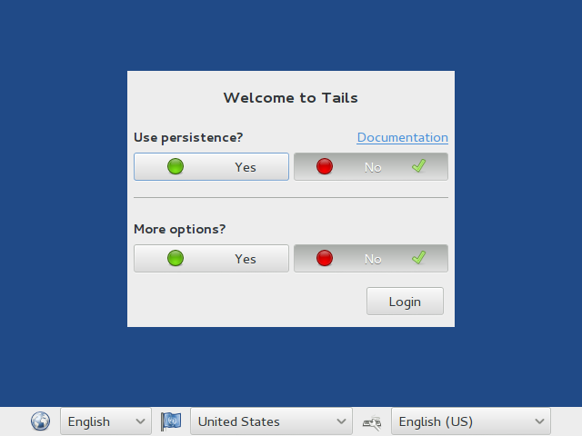
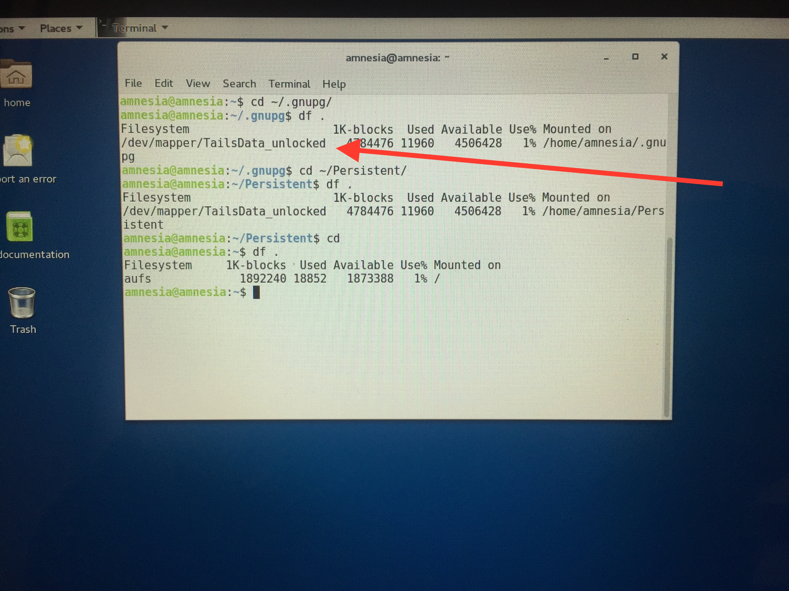
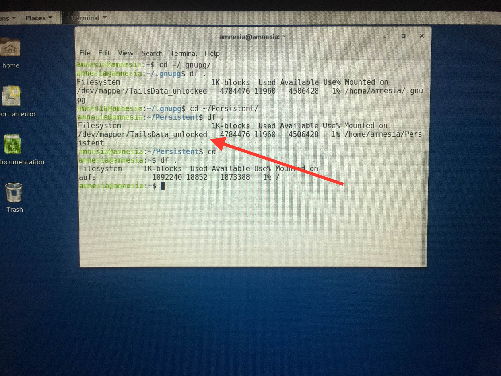
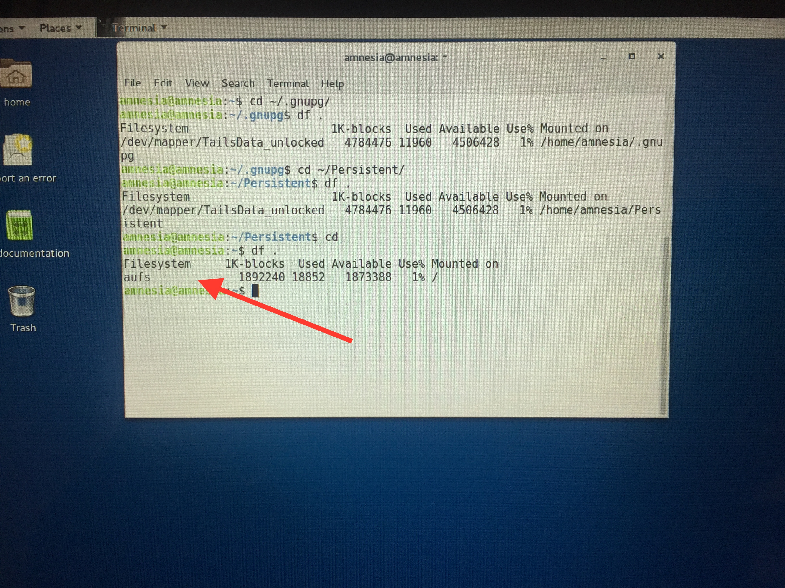

# GPG Key Setup

## Introduction

This is one of the most important steps toward having secure communications.

While other applications and hygiene are important, this one moves you from
being a "layperson avoiding the obvious traps" to be someone with some real
_understanding_ of security. While you can depend on Signal or Protonmail or
some third party to handle your secure communications, you will have _no
greater security_ than what is provided by encrypting your own content with
keys you generated in a safe fashion.

Take your time and welcome to the club! The actual key generation work will
generally take about 30 minutes if you have the equipment and familiarity
described in the Pre-Work, Ingredients, and Preparation steps.

## Pre-Work

If you're new to public-key cryptography, read the [Wand Metaphor for Cryptography][wand metaphor].

We've taken some of the more difficult components of public-key cryptography
and have translated them to the universe of magical wands (&agrave; la "Harry
Potter"). We hope this provides a conceptual framework.

## Ingredients

* 1-3 USB Sticks with 4GB or more of space. If you don't already have a USB key
  with a Tails installation on it, creation of the Tails USB key requires 2
  USB keys total. As such you'll need 3 USB keys. If you _already_ have a USB
  key with the Tails operating system installed on it, you'll only need one
  additional key.

## Preparation

### Tails Live USB Stick

[Tails][] is an "amnesiac" operating system.  That means it's an operating
system like Windows, OS X, or Linux that operates your computer's hardware and
gives you a way to make your computer do work.

Tails is **different** than those operating systems because Tails

1. Tails does not write data to your hard disk like your Desktop or home
   directory which could be seized by law enforcement, spies, disinformation
   activists, or space aliens
2. Tails cleans up any temporary files and memory you use. Applications you
   might use on Tails include browsers or email clients. When you shut down tails
   &mdash; or even yank out the USB key &mdash; tails  gets rid of all the
   temporary files that the browser or email client might have created. It even
   works to clean the memory that those applications might have used!

For these reasons Tails is, rightly, called "amnesiac."

If you don't have a Tails USB key lying around (and most people don't!), you
need to follow the [Installation Instructions document][Tails Installation]. To
do this from scratch requires **2 USB sticks**.

At the end of our process this Tails stick **will have all your precious encryption keys**.
You're going to put it somewhere safe (keep at home locked in a safe; keep in a
safe-deposit box, etc.) so don't plan on using it for other day-to-day needs.

### Daily-use USB stick

Blank. We'll need this to transfer your "daily use" key to your daily use
computer (the one that might get stolen or compromised by bad people).

### **3** Strong Passwords

**3** [strong passwords][strong]

### Computer

You need a computer to populate the USB keys with GPG keys.

Last year model PCs tend to work well. The author used a 5000 series Dell
Latitude for testing that he bought second-hand for < $300.00

**NOTE**: Recent-model Macs _cannot_ be used to run Tails. While you
**certainly** can create a Tails USB key on a Mac, many recent-generation Mac
laptops use a proprietary wireless card driver that Linux (and thus Tails) do
not support.  You _might_ be able to use a wired connection but this varies
with the year and model of your laptop. 

### Knowledge of How to Boot your Computer from USB Key

When you power-up a computer it will, by default, look for an operating system
on the internal disk or solid-state drive inside of the computer. You can tell
the computer to look for an operating system (say Tails) somewhere else during
boot-up. You'll need to find documentation on "how to book from a USB key" for
your particular computer. For example, on the testing Dell I used, when the big
Dell circle is on the screen, if you hit `F12` you see a menu where you can
choose to boot from USB Device. Since Tails is on the USB key (or device),
booting off of it will boot the computer into Tails versus Windows.

## Tails: A Safe Place

Why do we need Tails to generate encryption keys?  In short, you don't know if
your laptop has been compromised.

* Your employer might have installed a keyboard logger (which would capture the password you will use to initialize your key).
* You might have fallen prey to an email-based malware months ago that has remained resident on your computer for many months now (an "advanced persistent threat") and is reporting your keystrokes to a hostile agent in a country far-away
* Your cousin downloaded a free picture editor that installed spyware

If you're familiar with [the metaphor][wand metaphor]: what if someone had
bugged the wizard's workshop when he was making your wand? They saw the
ingredients; heard the magical password. They could clone _your_ wand and act
as you!

To make sure key-generation with `gpg` gets to operate in a safe environment,
we create our keys in Tails. Tails was the operating system Edward Snowden used
to communicate and to distribute his document cache.

### Step 1: Get a Tails System

_Skip this step if you already have a Tails boot stick_

The [Tails Installation Assistant][] should help you create your Tails USB key.

### Step 2: Configure a Persistent Volume On Your Tails Installation

_Skip this step if your Tails boot stick already has a persistent volume **and** has enabled GnuPG. If you don't know what this means, follow these steps._

Boot up your Tails installation.

_The "Tails Greeter"_

You will click the "Login" button. No complications this first time through!

Follow the [Tails Persistence Volume][TPV] instructions for creating a
Persistent Volume for both "Personal Files" and "GnuPG." You will be prompted
to add a password on this volume.

**IMPORTANT**: It's **VERY** important that you use a strong password here.

If a Bad Guy gets your Tails USB key and knows the persistent password they can
gain access to your master cryptographic keys &mdash;
**the private key will be vulnerable**  This is a **VERY BAD THING!**

After this step [restart Tails][].

### Step 3: Reboot Into Tails

Upon reboot, you should see the "Tails Greeter" again, but this time you'll
have an option for "Use persistence?" Select YES and you'll be immediately
prompted for your persistence volume password. Enter it **but don't click Login
yet**.

We also need more options so select YES under "More Options?"

Select Forward and you will be greeted with the Tails Admin Assistant:

### Step 4: Log Into Tails with an Administrator Password

Here set an admin password. This need not be secure, we're only going to use it
for this current Tails session. Needless to say, don't forget it while using
this guide. :)

### Step 6: Login

Click the "Login" button to log into Tails.

### Step 7: Verify Proper Disk Configuration

We want to make sure that our Persistence layer is properly configured. You
might not understand all these commands, but they are designed to help us
verify proper disk configuration.

Double-click on the Tails Desktop and select "Open Terminal." We're going to
use a tool called `du` which stands for "disk usage" to tell us where Tails
thinks the directory comes from. It would be like looking at a mail address and
saying "Oh, this house is in New York City" because the address says so. You
should be able to ask the owner where the house stands as well and get the same
answer.  Here we're going to make sure that the `.gnupg` and `~/Persistent`
directories comes from the "Persistent Data" neighborhood.

Enter the following commands:

`cd ~/.gnupg`  
`df .`  

You should see something like the following:

This directory should be on a "Filesystem" called `TailsData_unlocked`. That
means the GnuPG directory resides on the Persistence volume. Exactly what we
wanted!

`cd ~/Persistent`  
`df .`  

You should see something like the following:

This directory should be on a device called `TailsData_unlocked`.

This directory should be on a "Filesystem" called `TailsData_unlocked`. That
means the Persistence volume has the Persistence directory. Exactly what we
wanted!

`cd`  
`df .`  

The last directory (the "home directory") is on something called `aufs` which
is "Mounted on" `/`. The `aufs` Filesystem is part of the "amnesiac" part of
Tails: things created here will be wiped when Tails is restarted or the USB key
is pulled!

If these line up with your system, you're on the right path. With a Tails
system ready, we can move forward with creating the keys. Next we'll
immediately give an overview of our game plan and then we'll cut to doing the
commands.

## Step 8: Make the Battle Plan

### Sub-Step 8a: Generate the "Prime" Keypair

As discussed above and elsewhere, public key cryptography works by having a
**public key** and a **private key**. Be careful, don't confuse those with "USB
key!" A USB Key is a physical thing, a cryptographic key is like a file that
lives on a disk.

It is very important to keep your cryptographic _private key_ on a _USB key_
with a _strong Persistence volume password_ in a safe place (like a safe, or a
bank save deposit box). If someone gets your **private key** and learns the
password you use with that private key: **they can act as you and read encrypted mail being sent to you!**

Every step we take to make it harder to get that private key is an increase in
security!

Our first step will be to create the **public key** and the **private key**.

These keys are a bit like the ones you get from the landlord when you move into
your apartment: they're the originals and they should be _copied_ so that if you
lose them, you can generate more without paying a fee.

After we create this "prime" pair, we will generate a daily-use pair.

### Sub-Step 8b: Generate the Sub-keys

The next thing we'll do is generate a day-to-day keypair which acknowledges
your prime keypair as its superior.

To extend the landlord metaphor above, say you take your "prime" keys to your
new apartment to the locksmith and get a set of duplicates made. You then take
the prime keypair to the bank and put them in a safe deposit box. You then go
out and, curse the luck!, you lose your duplicate keys.

Instead of having to fear that someone found those keys, followed you home, and
is waiting to come in and steal your comic books, you go to the bank, open up
the safe deposit box, take out the prime keys and say "DESTROY DUPLICATE SET
ONE!" and *poof* the lost keys vanish from existence! You then return to the
locksmith, get a new pair made, return the prime pair, and then go on through
life with your daily use duplicates.

In public-key cryptography the stolen duplicates don't vanish, they are instead
"revoked" and thus labeled "untrustworthy."

### Sub-Step 8c: Secure the Prime Keypair

* Put the _sub-key_ somewhere you can use it regularly
* Put the "master" private key somewhere safe

OK, enough prelude, let's make that "Prime" keypair.

## Put GPG to Work

### Step 9: Create the Public / Private Pair

_As a supplementary reference, see [The GnuPG Manual](https://www.gnupg.org/gph/en/manual/c14.html)_

In the terminal type:

1. `cd`: make sure we start in your home directory
1. `gpg --gen-key`: This will start the process of generating your "Prime" keypair
2. Accept the default (1) RSA and RSA
3. For keysize choose 4096. This will make your `master` key the most complex and hard to steal possible
4. Set an expiration of "Never." The expiration date behaves the same as it
does on credit cards and for the same purpose. Since this key will be protected as well as
   possible and won't be taken into the world day-to-day, let's set this key to
   be non-expiring. Similarly if you only left your credit card in a bank safe,
   you could be rather comfortable with it having a distant expiry date. There
   are arguments to why this shouldn't be done. A happy medium might be `5y` or
   `10y` corresponding to five and ten years, respectively.
5. Accept these changes
6. Provide your real real name (here "Tutorial")
7. Provide a valid email address (here `tutorial@example.com`)
8. Leave comment blank
9. Select **O**kay
10. **SELECT A VERY STRONG PASSWORD** A weak password is the same as leaving your key under the mat. Make this very difficult to guess and / or store it in a password manager.
11. Re-enter it to confirm

Here's an example of what the output should look like:

Here we see "Tutorial" has an identity of `7EC9E024`. If you see a much longer
number beginning with `0x`, that's fine too!

Henceforth in this guide will use these two identifiers ("Tutorial" and
`7EC9E024`), but if you're typing along, use your name and key ID instead.

We also must prepare for the worst. Let's suppose somehow your master key
becomes compromised. You need an "anti-key" that will cancel the master key.
This is called a "revocation certificate." We'll create it right now and save
it in a safe place, on our Persistent volume.

Since "Tutorial" is `7EC9E024` I'll issue the following command.

`gpg --output ~/.gnupg/revoke.asc --gen-revoke 7EC9E024`

1. Confirm **y** to create the certificate
1. Accept default 1
1. Enter an empty line
1. Confirm **y**
1. You'll be prompted for your secret key password. That makes sense, right? In
   order to say "This is no good!" you have to be tested as knowing the password.

Congratulations! You now have your cryptographic keys. They are generated and
stored in your `~/.gnupg` directory which, per our earlier configuration of
Tails, is on the Persistent drive. You have also created a revocation
certificate which is also in `~/.gnupg` in the file `revoke.asc`.

Again, if someone gets your Tails USB key and knows your Persistent password
**they can get your secret key and do things as you if they know your password!**.
Or, they could get your `revoke.asc` and revoke your key! Keep the password and
the USB key secret and safe!

**!!! IT IS VERY IMPORTANT TO KEEP THIS USB KEY SAFE !!!**

## Step 10: Create Subkeys for Daily use

With all those warnings, we understand that we need to keep our "prime" keypair
safe in a safe-deposit box or wall-safe. We now need to create that "duplicate"
set that we can use in a less secure environment (e.g. our daily-use laptop).

Here's the conceptual plan:

1. You have a public / private keypair ("prime keypair") in a keyring
2. Generate a new sub-key on that keyring (public/private) for encryption
2. Generate a new sub-key on that keyring (public/private) for signing
4. Copy the keyring and remove the "prime" private key
5. Keyring now has a public subkey, private subkey, public "prime" key, and a ghost private "prime" key
6. This is your "daily use" keyring

Let's do it!

1. Start in the Terminal again. Right click on the desktop to re-open one, if needed.
1. `cd`
1. `umask 077; tar -cf $HOME/Persistent/gnupg-prime-backup.tar -C $HOME .gnupg`
1. Verify: `ls ~/Persistent` should show `gnupg-prime-backup.tar` as being a file
1.  Congratulations, on your Persistent drive you have a backup of the keys `gpg` created in case something bad happens. Again, this is all the more reason to make sure that this USB key does not become compromised
1.  `gpg --edit-key 7EC9E024`: Remember, this is "Tutorial's" identifier. This will open the `gpg` prompt
1.  `addkey`
1.  Provide your secret key
1.  Choose "(6) RSA (encrypt only)"
1.  Enter 4096
1.  Set expiry for "1y"
1.  **y** for correct
1.  **y** for really create
1.  `list`

You'll now see you have a `pub` that never expires: your "prime" public key.
You have a "sub" that also never expires. This is your "encrypting" key.
It's easier to think of these two as making up your prime public and private
keys. There's some detail here that's out of scope for this walk-through.

But the sub-key you *just* created has been added. It's the last `sub` listed.
You'll see that there's a marker of `[ultimate] ... Tutorial`. That means that
"Tutorial" endorses this key. That makes sense, it's a sub-key after all!

We now want to *repeat* this process and create a sub *signing* key. This is
commonly used for identity verification. We won't cover that in this
walk-through, but we want you to have this in place in case you ever want to
take advantage of this feature.

Since we're still at the `gpg` prompt:

1.  `addkey`
1.  Choose "(4) RSA (sign only)"
1.  Enter 4096
1.  Set expiry for "1y"
1.  **y** for correct
1.  **y** for really create
1.  `list`

You'll now notice you have yet another subkey. You'll notice that it has
`usage: S` for **S**igning. The other subkey you created had **E** for
**E**ncryption.

Enter `save` to leave the `gpg` prompt.

<!-- https://ekaia.org/blog/2009/05/10/creating-new-gpgkey/ -->
<!-- https://www.paulfurley.com/gpg-for-humans-protecting-your-primary-key/ -->

## Step 11: Switch!

Let's back up our full keyring with the "prime" and "subkeys" on it.

1. `cd`
1. `umask 077; tar -cf $HOME/Persistent/gnupg-with-subkey-backup.tar -C $HOME .gnupg`
1. Verify: `ls ~/Persistent` should show `gnupg-with-subkey-backup.tar` as being a file
1.  Congratulations, on your Persistent drive you have a backup of the keys `gpg` created in case something bad happens. Again, this is all the more reason to make sure that this USB key does not become compromised

Let's create one last backup of the full keyring directory with:

`cp -r ~/.gnupg ~/Persistent/gnupg-full`

Our next steps are going to do **DESTRUCTIVE** changes on what's in `~/.gnupg`,
but won't touch this directory.

## Step 12: Remove the "Prime" Key-pair

Take a look at the key database with `gpg --list-secret-keys`

The top key is our _master_ (or _prime_) **private** key and it needs to get
out for the daily-use keyring. We're going to *export* the stuff we need to
save, remove the stuff that needs to go away, and then re-import the stuff we
set aside.

`gpg --output /var/tmp/secret-subkeys --export-secret-subkeys 7EC9E024`

This step says "hey, all those secret subkeys that were hanging off of
`7EC9E024`, export them to a file called `/var/tmp/secret-subkeys`. Since we're
using Tails, we can write these secure data to a file in `/var/tmp` because
Tails scrubs that directory when we end our Tails session. We'll even do
another technique to make sure this temporary file is scrubbed thoroughly in a
moment.

`gpg --delete-secret-keys 7EC9E024` with **y** to confirm and **y** again. I know, it's scary!

This removes our top-level, _prime_, _master_ private key. This account can no
longer decrypt content encrypted with the _master_, _prime_ public key.

`gpg --import /var/tmp/secret-subkeys`

You will see feedback reporting that a secret key was imported.

This will re-import the sub-keys but with the private _master_ key as a
"ghost". If you perform `gpg --list-secret-keys`, you'll see the private key is
listed with an `#`. This denotes that `gpg` knows these subkeys have a parent,
but it's not in the keyring.

Let's remove that temporary file 

`shred -u /var/tmp/Persistent/secret-subkeys`

This fills the temporary file with junk and then deletes it. Another pass of
scrubbing will be done by Tails when we exit.

Lastly, the password on this "de-mastered" keyring is still the same as your
original strong password. Apply your third (and final) password to this key
with: `gpg --edit-key 7EC9E024 passwd`

You'll be asked for your original password, now provide a new strong password
and verify it. Enter `save` to exit the `gpg` prompt.
Tails.

## Step 13: Move Daily-use Credentials

At this point, on your Tails installation you have your master credentials. We
now need to get your daily-use credentials on your second USB stick so that you
can carry those credentials to you day to day OS or computer.

Insert another USB key into the computer. For Unix people: "We need to mount
the new USB disk and copy the subkey information onto the drive."

Let's find out how tails sees this new USB key. Run `sudo dmesg`. You'll have
to use the administrator password you provided when you logged into Tails. You
should see that Tails notes that something `Attached SCSI removable disk`.
Before that there should be a `[]` with a device name in it. On my system it's
`sdb`. That's how Tails "sees" the USB stick.

3. I'm going to use the first partition of this device thus `/dev/` + device `sdb` + partition `1` thus my "device name" is `/dev/sdb1`.
4. I need a "mount point" a directory on the disk that will tunnel data back to `/dev/sdb1`. We will use `/mnt`
4. We need to know our user id. Enter `id -u`. This will typically be `1000`.  We will use this number in the next step.
5. I enter the command: `sudo mount /dev/sdb1 /mnt -o uid=$ID_VALUE_FROM_PREVIOUS_STEP`
7. Copy the hobbled keyring over: `cp -r ~/.gnupg /mnt/gnupg`
8. `cd /mnt/gnupg`
9. `gpg --homedir . -K`: The output should show the subkey with master key removed (`sec#`).

Awesome! We're now going to export our subkey-private and subkey-public keys so
that we can import them on whatever operating system we use day-to-day. While
we would *never* write out our **prime** private key, we're less secure with
our subkey-private key. We can do things to clean-up this data in case this USB
key were to get stolen, but since it is a subkey, we can use the power of the
prime key to revoke it.

`gpg --homedir . -k`

We know that our penultimate (next-to-last) key is our encryption subkey. We're
going to take note of it unique identifier: `4096R/0x......` we're going to
copy the `0x....` to the clipboard. That's our `ENCRYPTION_SUBKEY_ID` used
below:

9. `gpg --homedir . --export -a  ENCRYPTION_SUBKEY_ID > public_subkey.asc`: write out a copy of your subkey-public key, you'll want to share this with the world so people can contact you securely!
9. `gpg --homedir . --export-secret-key -a  ENCRYPTION_SUBKEY_ID > private_subkey.asc`: write out your subkey-private key
10. `cd && sudo umount /mnt`

## Step 14: Cleanup

Let's make the default GPG directory for Tails the one that has your full
secret key. You'll only ever need Tails again if you need to revoke your subkey
or generate a new one.

1. `rm -r ~/.gnupg/*`
2. `cp -r ~/Persistent/gnupg-full/* ~/.gnupg`
3. `gpg --list-secret-keys` should show that your private key is the real deal (i.e. no `sec#` but rather `sec`)

First, power-off tails. This will clean up all your vulnerable data.  Take the
Tails USB key and hide it away! Take the USB key with your subkeys. We're now
going to make those keys available for your use.

## Step 15: Reboot / Visit your standard Machine

### Linux

* `gpg -k` will initialize a directory if required
* Plug in your subkeys USB key. Ubuntu mounts this USB key as `/users/username/media/6454`
* `gpg --import /media/username/media/6454/gnupg/public_subkey.asc`
* `gpg --import /media/username/media/6454/gnupg/private_subkey.asc`
* This will ask you for a password. The password will be the one you provided when you changed the strong password on your private key

You might see some warning about upgrading the key. This is fine.

### Windows

* Install [Gpg4Win][]
* Open "Kleopatra" – Installed as part of the [Gpg4Win][] install
* Click "Import Certificates"
* Browse to your USB key
* Select your `private_subkey.asc` file; provide the password when prompted
* Repeat the above for your `public_subkey.asc` key file
* All set!

### OSX

OSX operates as Linux.

## Conclusion

Congratulations. You now have:

* 1 Tails USB disk with a persistent directory that stores all your "master"
    encryption data. Store this in a safe place.
* 1 USB key that has your public-use subkey that can be used on a "daily"
    system. Once you import the subkey contents to your daily-use system, you
    might consider storing this key in the safe place, or deleting its
    contents. From a Linux machine you can use `find
    /media/username/media/6454/gnupg -type f |xargs shred -u` and then  `rm -rf
    /media/username/media/6454/gnupg` to finish the job.

You can now share your daily-use subkey public key so that people can send you
messages to be decrypted with your private key.

## Further Directions

There are further realms to explore with your keys. You can use your public and
private keypair as a signature to say "I sign off on this message, and if
anyone changes this message's content, you'll know it!" You can also validate
that people you know have the keys which bear their names so as to create a web
of trust. You can even take your daily-use subkeys and put them on a piece of
hardware like a [Yubikey Nano][nano] so that the subkey credentials can be inserted and
removed when you see fit! Depending on your security need, there are many paths
to pursue!

[Gpg4Win]: https://www.gpg4win.org/
[TPV]: https://tails.boum.org/doc/first_steps/persistence/configure/index.en.html
[TPVu]: https://tails.boum.org/doc/first_steps/persistence/use/index.en.html
[Tails Installation Assistant]: https://tails.boum.org/install/index.en.html
[Tails Installation]: https://tails.boum.org/doc/index.en.html
[Tails]: https://tails.boum.org
[restart Tails]: https://tails.boum.org/doc/first_steps/shutdown/index.en.html.
[strong]: http://www.howtogeek.com/195430/how-to-create-a-strong-password-and-remember-it/
[wand metaphor]: ./public_key_crypto_metaphor.md
[nano]: https://www.yubico.com/products/yubikey-hardware/yubikey4/
