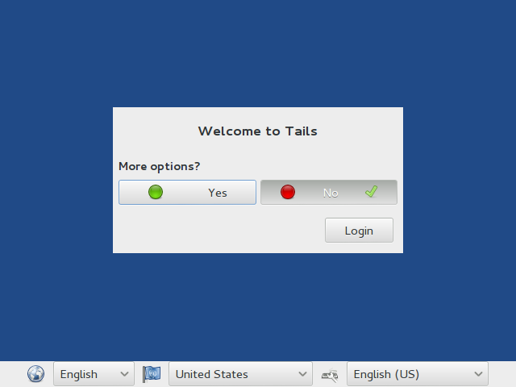
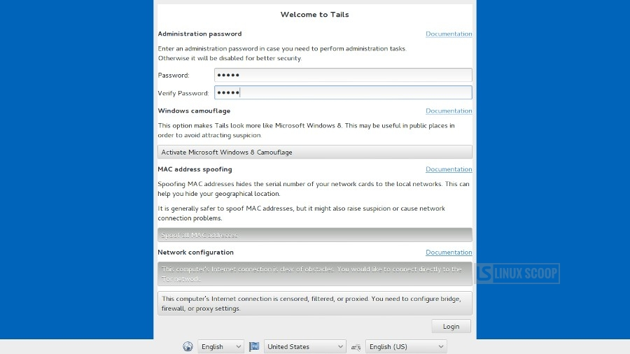

# GPG Key Setup

## Introduction

This is one of the most important steps toward having secure communications.

While other applications and hygiene are important, this one moves you from
being a "layperson avoiding the obvious traps" to be someone with some real
_understanding_ of security.

Some of the steps are onerous, but they're designed for your protection and
we'll have some reasoning behind each one. Take your time and welcome to the
club!

## Pre-Work

If you're new to public-key cryptography, read the [Wand Metaphor for Cryptography][wand metaphor].

We've tried to take some of the more difficult components of public-key
cryptography and have translated it to the universe of magical wands (&agrave;
la "Harry Potter"). We hope this provides a conceptual framework.

## Ingredients

* 1-3 USB Sticks with 4GB or more of space. If you don't already have a Tails
  instance, you'll need 3. If you already have a USB stick running Tails,
  you'll need one additional stick.

## Preparation

* [Tails Live USB Stick][]: [Tails][] is a system for creating an "amnesiac"
  operating system. That means it's an operating system like Windows, OS X, or
  Linux that operates your computer's hardware and gives you a way to make your
  computer do work. You need to follow the
  [Installation Instructions document][Tails Installation]. To do this from
  scratch requires **2 USB sticks**.  At the end of our process this Tails
  stick **will have all your precious encryption keys**. You're going to put it
  somewhere safe (keep at home, lock in a safe, keep in a safe-deposit box,
  etc.) so don't plan on using it for other day-to-day needs.
* **Daily-use USB stick**: Blank. We'll need this to transfer your "daily use"
  key to your daily use computer (the one that might get stolen or compromised
  by bad people).
* **3** [strong passwords][strong]

**NOTE**: Recent-model Macs _cannot_ be used to run Tails. The wireless
hardware is not supported by Tails. You _might_ be able to use a wired
connection but this varies with the year and model of your laptop. By way of
comparison, last year model PCs tend to work well. The author used a 5000
series Dell Latitude for testing.

## Tails: A Safe Place

Why do we need Tails to generate encryption keys?  In short, you don't know if
your laptop has been compromised.

* Your employer might have installed a keyboard logger (which would capture the password you used to initialize your key).
* You might have fallen prey to an email-based malware months ago that has remained resident on your computer for many months now.
* The library computer where you generate your keys has been compromised, etc.

If you're familiar with [the metaphor][wand metaphor]: what if someone had
bugged the wizard's workshop when he was making your wand: saw the ingredients,
hears the magical password? They could clone _your_ wand and act as you!

To make sure `gpg` gets to operate in a safe house (or safe operating system)
we create our keys in Tails - it's like a brand new operating system each time
you boot up!  For this reason it's called an "amnesiac" operating system.
Because it's a read-only operating system nothing you view on the internet can
"infect" it and compromise the safety of the room where `gpg` works. Tails was
the operating system Edward Snowden used to communicate and to distribute his
document cache.

## Giving GPG a Safe Environment

### Step: Get a Tails System

_Skip this step if you already have a Tails boot stick_

The [Tails Installation Assistant][] should help you get your bootable USB stick.

### Step: Add a Persistent Volume To Your Stick

_Skip this step if your Tails boot stick already has a persistent volume **and** has enabled GnuPG. If you don't know what this means, follow these steps._

Boot up your Tails installation.

You will click the "Login" button. No complications this first time through!

Follow the [Tails Persistence Volume][TPV] instructions for creating a
Persistent Volume for both "Personal Files" and "GnuPG." You will be prompted
to add a password on this volume.

**IMPORTANT**: It's **VERY** important that you use a strong password here.

If a Bad Guy gets your Tails USB key and knows the persistent password they can gain access to your master cryptographic keys -- **the private key will be vulnerable**  This is a VERY BAD THING!

After this step [restart Tails][].

### Step: Reboot Into Tails

Upon reboot, you should see this (again). This time you'll need to say YES.

Say "Yes" and you will be greeted with the Tails Admin Assistant:

You'll want to both enable an Administrator Password and Enable Persistence.

_The "Tails Greeter"_

### Step: Log Into Tails with an Administrator Password

Here set an admin password. This need not be extremely secure, we're only going
to use it for this current Tails session. On the other hand, don't forget it or
you'll have to restart this process.

### Step: Enable Persistence

Since we set up a persistence volume in a previous step, also provide that
password here. Here's [Tails Guide to Using a Persistent Volume][TPVu]

### Step: Login

Click the "Login" button to log into Tails.

### Step: Verify Configuration

Double-click on the desktop and select "Open Terminal." We're going to use a
tool called `du` which stands for "disk usage" to tell us where Tails thinks
the directory comes from. It would be like looking at a mail address and saying
"Oh, this house is in New York City" because the address says so. You should be
able to ask the owner where the house stands as well and get the same answer.
Here we're going to make sure that the `.gnupg` and `~/Persistent` directories
comes from the "Persistent Data" neighborhood.

Enter the following commands:

`cd ~/.gnupg`  
`df .`  

You should see something like the following:

This directory should be on a device called `TailsData_unlocked`.

`cd ~/Persistent`  
`df .`  

You should see something like the following:

This directory should be on a device called `TailsData_unlocked`.

`cd`  
`df .`  

The last directory (the "home directory") is on something called `aufs` which
is "Mounted on" `/`.

If these line up with your system, you're on the right path. With a Tails
system ready, we can move forward with creating the keys. Next we'll
immediately give an overview of our game plan and then we'll cut to doing the
commands.

## Step: Make the Battle Plan

### Sub-Step: Generate the Prime Keypair

As discussed above and elsewhere, public key cryptography works by having a
**public key** and a **private key**. We will make those. But these keys are a
bit like the ones you get from the landlord when you move into your apartment:
they're the originals and they should be copied so that if you lose them you
can generate more.

Your first public and private key (your "prime" keypair) should be put
somewhere safe where they can never be corrupted. So we're going to generate
your prime keypair and store it on the persistent Tails directory. That's why
your Tails USB key is so important and why, after we generate your keys, it
shouldn't be carried around day-to-day.

### Sub-Step: Generate the Sub-keys

The next thing we'll do is generate a day-to-day keypair which acknowledges
your prime keypair as its superior. Should your day-to-day keypair ever become
compromised (the laptop they live on gets stolen), you can get a new machine,
your Tails key, and can generate a revocation certificate for the stolen
keypair which says "I DO NOT TRUST THIS ANYMORE AND YOU SHOULDN'T TRUST IT
EITHER!" Then, you can generate a new day-to-day keypair, put it on your new
laptop and you're back in business.

### Sub-Step: Secure the Prime Keypair

* Create a _sub-key_
* Put the _sub-key_ somewhere you can use it regularly
* Put the "master" private key somewhere safe

## Put GPG to Work

### Create the Public / Private Pair

_As a supplementary reference, see [The GnuPG Manual](https://www.gnupg.org/gph/en/manual/c14.html)_

In the terminal type:

1. `gpg --gen-key`
2. Accept the default (1) RSA and RSA
3. For keysize choose 4096. This will make your `master` key the most complex and hard to steal possible
4. Set an expiration of "Never." The expiration date behaves the same as it
does on credit cards and for the same purpose. Since this key will be protected as well as
   possible and won't be taken into the world day-to-day, let's set this key to
   be non-expiring. Similarly if you only left your credit card in a bank safe,
   you could be rather comfortable with it having a distant expiry date. There
   are arguments to why this shouldn't be done. A happy medium might be `5y` or
   `10y` corresponding to five and ten years, respectively.
5. Accept these changes
6. Provide your real real name (here "Tutorial")
7. Provide a valid email address (here `tutorial@example.com`)
8. Leave comment blank
9. Select **O**kay
10. **SELECT A VERY STRONG PASSWORD** A weak password is the same as leaving your key under the mat. Make this very difficult to guess and / or store it in a password manager.
11. Re-enter it to confirm

Here's an example of what the output should look like:

Here we see "Tutorial" has an identity of `7EC9E024`. Henceforth in this guide
will use these two identifiers, but if you're typing along, use your name and
key ID instead.

We also must prepare for the worst. Let's suppose somehow your master key
becomes compromised. You need an "anti-key" that will cancel the master key.
This is called a "revocation certificate." We create it right now in the most
optimistic moment and we save it in a safe place, on our Persistent volume.

Since "Tutorial" is `7EC9E024` I'll issue the following command.

`gpg --output ~/.gnupg/revoke.asc --gen-revoke 7EC9E024`

Then confirm **y** to create the certificate and accept default 1. Enter an
optional description.  Given that you're revoking your most-precious key, I
think it's hard to come up with a good thing to put here, so I'd leave it
blank. Accept with **y**. You'll be prompted for your secret key password.

Congratulations! You now have your cryptographic keys. They are generated and
stored in your `~/.gnupg` directory which as per our earlier configuration of
Tails, is on the Persistent drive. You have also created a revocation
certificate which is also in `~/.gnupg` in the file `revoke.asc`.

Again, if someone gets your Tails USB key and knows your Persistent password
**they can get your secret key and do things as you!**. Or, they could get your
`revoke.asc` and revoke your key!

**!!! IT IS VERY IMPORTANT TO KEEP THIS USB KEY SAFE !!!**

## Create Subkeys for Daily use

Now, we just said we want to keep our "prime keypair" safe. They should be kept
safe in a safe-deposit box or wall-safe. How can we get the benefits of GPG
without a ton of hassle? We want to create sub-keys that we can put on our
laptop.

This is a rather convoluted process but it comes out like this.

1. You have a public / private keypair ("prime keypair") in a keyring
2. Generate a new sub-key on that keyring (public/private) for encryption
3. Move this keyring to a safe place
4. Copy the keyring and remove the "prime" private key
5. Keyring with public subkey, private subkey, public "prime" key, and a ghost private "prime" key

1. Start in the Terminal again. Right click on the desktop to re-open one, if needed.
1. `cd`
1. `umask 077; tar -cf $HOME/Persistent/gnupg-backup.tar -C $HOME .gnupg`
1.  Congratulations, on your Persistent drive you have a backup of the keys `gpg` created in case something bad happens. Again, this is all the more reason to make sure that this USB key does not become compromised
1.  `gpg --edit-key 7EC9E024`: Remember, this is "Tutorial's" identifier. This will open the `gpg` dialog
1.  `addkey`
1.  Provide your secret key
1.  Choose "RSA (sign only)"
1.  Enter 4096
1.  Set expiry for "1y"
1.  **y** for really create
1.  `list`

(_For these steps we followed the path defined in the [Debian Subkeys
Guide](https://wiki.debian.org/Subkeys)). Also this post by [Ana Beatriz
Guererro López](https://ekaia.org/blog/2009/05/10/creating-new-gpgkey/))

As you can see, the new key `963ABC84` now exists and it has `usage: S`
(subkey) and it has "ultimate" trust to the original key of "Tutorial." That
is, `963ABC84` knows its spawned from `7EC9E024`, the master private key.
`963ABC84` will go into the world as a "representative of" the master private
key but is only just that: a representative, a symbol of the authority of a
thing somewhere else – rather like a diplomat.

`7EC9E024` should also inform the world that it endorses `963ABC84` as its
representative. Enter `save` to exit the `--edit-key` menu. Endorse the new key
with: `gpg --default-key 7EC9E024 --sign-key 963ABC84`. Do the same with any
other subkeys you created.

However, we've only created a _signing_ subkey. If we want to encrypt, we also
want to create an encryption subkey. Follow the same steps as above but specify
"(6) RSA (encrypt only)." Similarly the parent key (`7EC9E024`) should be used to
sign any newly created keys.

## Step: Switch!

`cp -r ~/.gnupg ~/Persistent/gnupg-master-Tutorial-7EC9E024`

I recommend this long informative name for easy recall. You won't type this
information often, so name it informatively. At this point, `~/.gnupg` and 
`~/Persistent/gnupg-master-Tutorial-7EC9E024` have the full keyring
information.

Our next steps are going to do **DESTRUCTIVE** changes on what's in `~/.gnupg`,
but won't touch the other directory.

## Step: Remove the "Prime" Key-pair

Take a look at the key database with `gpg --list-secret-keys`

The top key is our _master_ (or _prime_) key and it needs to get out for the
daily-use keyring. We're going to *export* the stuff we need to save, remove
the stuff that needs to go away, and then re-import the stuff we set aside.

`gpg --output /var/tmp/secret-subkeys --export-secret-subkeys 7EC9E024`

This step says "hey, all those secret subkeys that were hanging off of
`7EC9E024`, export them to a file called `/var/tmp/secret-subkeys`. Since we're
using Tails, we can write these secure data to a file in `/var/tmp` because
Tails scrubs that directory when we end our Tails session.

`gpg --delete-secret-keys 7EC9E024` with **y** to confirm and **y** again. I know, it's scary!

This removes our top-level, _prime_, _master_ private key. This account can no
longer decrypt content encrypted with the _master_, _prime_ public key.

`gpg --import ~/var/tmp/secret-subkeys`

This will re-import the sub-keys but with the private _master_ key as a
"ghost". If you perform `gpg --list-secret-keys`, you'll see the private key is
listed with an `#`. This denotes that `gpg` knows these subkeys have a parent,
but it's not in the keyring.

`rm ~/Persistent/secret-subkeys`

This deletes the temporary file. A thorough disk scrubbing will be done by
Tails.

Lastly, the password on this "de-mastered" keyring is still the same as your
original strong password. Apply your third (and final) password to this key
with: `gpg --edit-key 7EC9E024 passwd`

## Step: Move Daily-use Credentials

At this point, on your Tails installation you have your master credentials. We
now need to get your daily-use credentials on your second USB stick so that you
can carry those credentials to you day to day OS or computer.

Insert this USB stick into the computer. For Unix people: "We need to mount the
new USB disk and copy the subkey information onto the drive."

1. Run `lsblk` this means :List Block Devices, aka Disks
2. On my system `sda` has a tree that has a bunch of Tails partitions. `sda` means device `a`. Its partitions are `sda1`, `sda2`, etc.
3. `sdb` looks similar, but seems to be the right size of the USB stick I injected. I'm going to use the first partition of this device thus `/dev/` + device `sdb` + partition `1` thus my "device name" is `/dev/sdb1`.
4. I need a "mount point" a directory on the disk that will tunnel data back to `/dev/sdb1`.
5. I enter the command: `sudo mount /dev/sdb1 /mnt -o umask=000`
6. This means any user can write to this "directory."
7. Copy the hobbled keyring over: `cp -r ~/.gnupg /mnt/gnupg`
8. `cd /mnt/gnupg`
9. `gpg --homedir . -K`: The output should show the subkey with master key removed (`sec#`).
9. `gpg --export -a  ENCRYPTION_SUBKEY_ID > public.key`: write out a copy of your public key, other tools that sign as you will need this
9. `gpg --export-secret-key -a  ENCRYPTION_SUBKEY_ID > private.key`: write out your public key, you'll want to share this with the world so people can contact you securely!
10. `cd && sudo umount /mnt`

## Cleanup

Let's make the default GPG directory for Tails the one that has your secret key.

1. `rm ~/.gnupg/*`
2. `cp ~/Persistent/gnupg-master-Tutorial-7EC9E024/* ~/.gnupg`
3. `gpg -K` should show that your private key is the real deal (i.e. no `sec#` but rather `sec`)

First, [restart Tails][]. This will clean up all your vulnerable data.  Take
the Tails USB key and hide it away! Take the USB key with your subkeys. We're
now going to make those keys available for your use.

## Reboot / Visit your standard Machine

### Linux

* `gpg -k` will initialize a directory if required
* Plug in your subkeys USB key
* `gpg --import /path/to/key/public.key`
* `gpg --import /path/to/key/private.key`

You might see some warning about upgrading the key. This is fine.

### Windows

* Install [Gpg4Win][]
* Open "Kleopatra" – Installed as part of the [Gpg4Win][] install
* Click "Import Certificates"
* Browse to your USB key
* Select your private key file
* Repeat the above for your public key file
* All set!

### OSX

OSX operates as Linux.

[Gpg4Win]: https://www.gpg4win.org/
[Tails Installation Assistant]: https://tails.boum.org/install/index.en.html
[TPV]: https://tails.boum.org/doc/first_steps/persistence/configure/index.en.html
[Tails]: https://tails.boum.org
[Tails Installation]: https://tails.boum.org/doc/index.en.html
[strong]: http://www.howtogeek.com/195430/how-to-create-a-strong-password-and-remember-it/
[wand metaphor]: ./public_key_crypto_metaphor.md
[restart Tails]: https://tails.boum.org/doc/first_steps/shutdown/index.en.html.
[TPVu]: https://tails.boum.org/doc/first_steps/persistence/use/index.en.html
